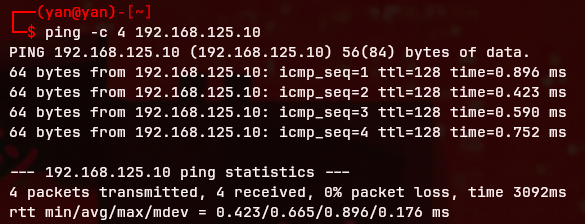
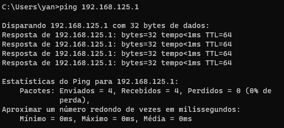

# AD-Security-Lab-KVM
Ambiente isolado para testes de GPO, auditoria de logs e simulação de infraestrutura corporativa.

##  1. Visão Geral  

  Criação de um ambiente de rede isolado para simulação de estrutura  
 corporativa, focado em Active Directory, Hardening de Sistemas e  
 Auditoria de Logs. O laboratório utiliza virtualização via KVM/QEMU no  
 linux.  

##  2. Topologia do Laboratório
  
  Host: Linux Mint (Kernel 6.17.0.-23-generic)  
  Domain Controller: Windows server 2025 (192.168.125.10)  
  Workstation: Windows 11 Pro (192.168.125.20)  
  Rede: Isolada (192.168.125.0/24) com integração via Samba para transferência de arquivos.  

##  3. Implementações Técnincas  

 Segregação de Tráfego: Configuração de interfaces virtuais isoladas no 
Virt-Manager para garantir que o tráfego do laboratório não vaze para a 
rede física do host. 

 Provisionamento de Domain Controller: Promoção do Windows Server a DC, 
configuração de AD DS (Active Directory Domain Services) e estruturação 
de DNS interno para resolução de nomes do domínio. 

 Interoperabilidade Cross-Platform: Implementação de servidor Samba no 
Host (Linux) com ajustes de permissões e Firewall (UFW) para permitir a 
transferência segura de ferramentas de análise para as máquinas Windows.
 

 Ajustes de Segurança no Windows 11: Modificação de políticas de grupo 
(GPO) e registros de sistema para permitir logons de convidados 
inseguros e ajustes de SMB Signing, necessários para comunicação em 
ambientes de teste. 

## 4. Troubleshooting (Desafios Superados) 

 Diagnóstico de conectividade: Identifiquei que o tráfego ICMP (Ping) estava sendo descartado pelo Firewall do Windows, mesmo com a interface de rede virtual corretamente vinculada ao Host. Corrigi isso ajustando as regras de entrada para validar a comunicação entre as VMs.

 Bypass de Requisitos: Uso de comandos OOBE para contornar a exigência 
de conta Microsoft e conexão à internet durante a instalação do Windows 
11 em ambiente isolado. 

## 5. Como Reproduzir

-1 Hypervisor: Instalar virt-manager e qemu-kvm no Linux Host.

-2 Rede: Criar uma rede virtual isolada no Virt-Manager com o range 192.168.125.0/24.

-3 Instalação: No Windows 11, utilizar Shift + F10 e o comando OOBE\BYPASSNRO para instalação offline.

No Windows Server, instalar a Role de AD DS via Server Manager.

-4 Conectividade: Fixar IPs estáticos e apontar o DNS da Workstation para o IP do Domain Controller.

-5 Integração: Configurar o serviço smbd no Linux e ajustar o gpedit.msc no Windows para habilitar logons de convidado.

### Evidências Técnicas

#### Teste de Conectividade (ICMP)

Host para VM Server

VM Win 11 Pro para Host

  

>>>>>>> 316bf94 (add pretty image)
